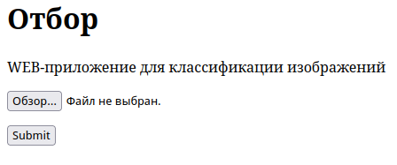
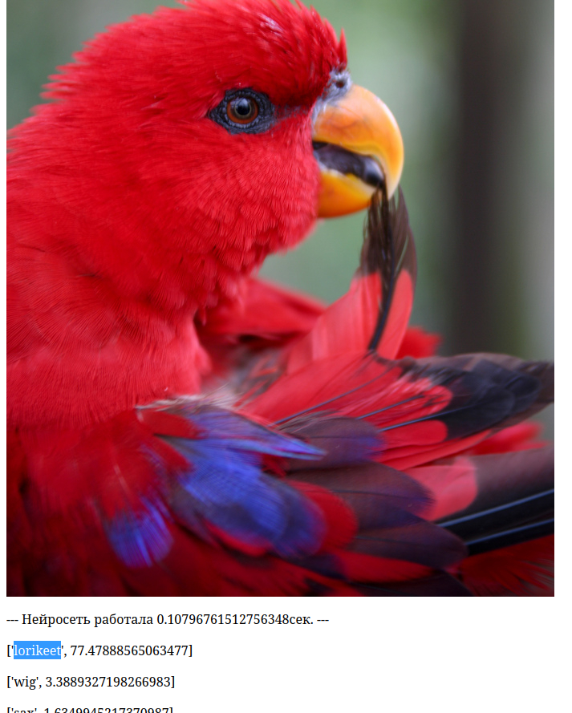

# Web-приложение для классификации главного объекта на изображении

Web обёртка для нейросети через библиотеку ImageAI.

# Установка

Для запуска приложения необходимы следующие компоненты:

* Python 3.7.6
* Tensorflow 2.4.0
* OpenCV 
* Keras 2.4.3

Рекомендуется создать в каталоге проекта виртуальное окружение для приложений python.

```
python3.7 -m venv envname
```

Активируем виртуальное окружение python:

```
source envname/bin/activate
```

Установим в окружение необходимые зависимости:

```
pip install tensorflow==2.5.0 keras==2.4.3 numpy==1.19.3 pillow==7.0.0 scipy==1.4.1 h5py==3.1.0 matplotlib==3.3.2 opencv-python keras-resnet==0.2.0
```

Установка библиотеки imageai

```
pip install imageai --upgrade
```

В качестве фреймворка для web приложения выступит библиотека Flask:

```
pip install Flask Werkzeug
```

# Получение нейросети

Перейдите в [релизы](https://github.com/OlafenwaMoses/ImageAI/releases/tag/essentials-v5) библиотеки и скачайте файл `resnet50_imagenet_tf.2.0.h5`.

Поместите этот файл в каталог "`models`".

# Запуск

Для запуска приложения, войдите в окружение и запустите фреймворк:

```
source envname/bin/activate
flask run
```

Теперь можно получить доступ к приложению по ссылке `http://127.0.0.1:5000/`

Пример работы приложения:



